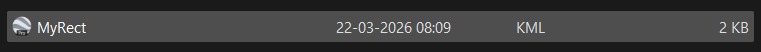
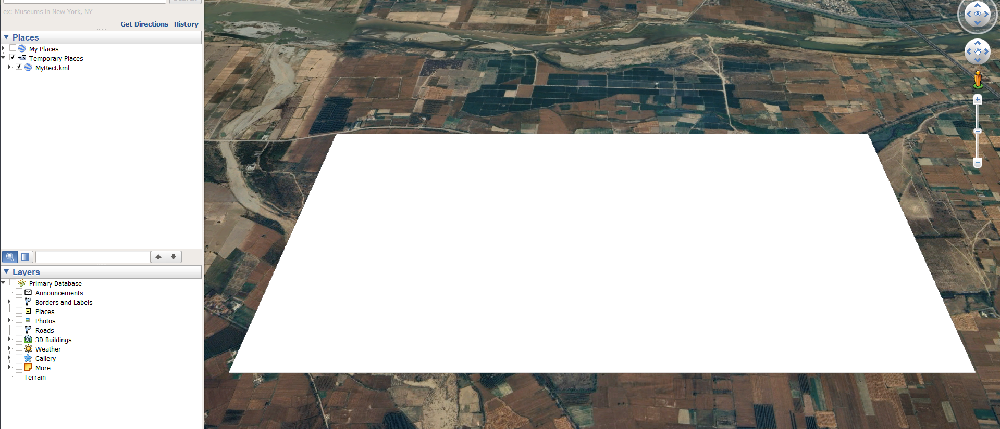
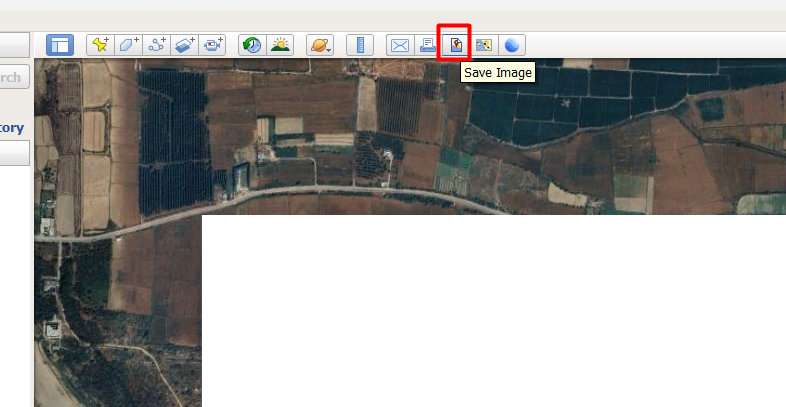
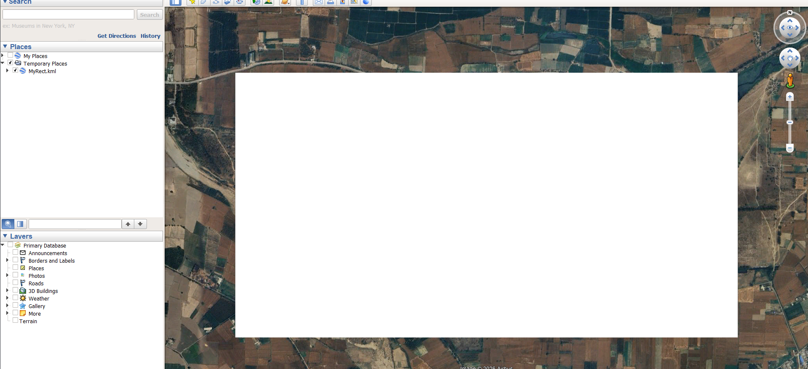
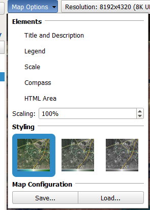
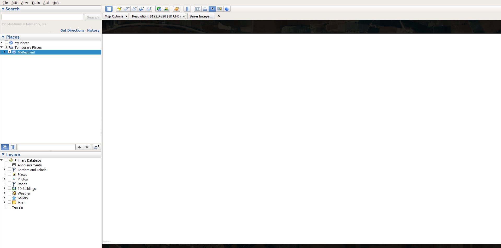
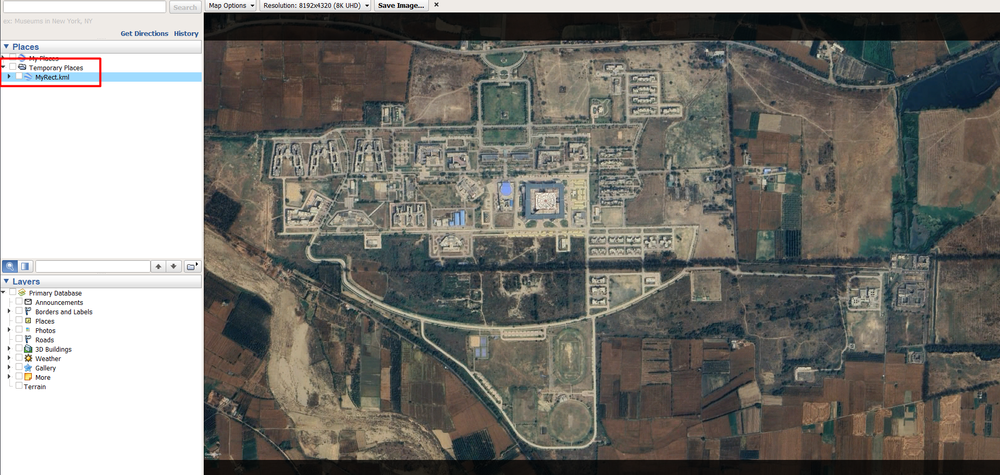

# Satellite Image → Campus Map — Complete Workflow

End-to-end guide: from a fresh Google Earth Pro install to a live, calibrated campus map.

---

## Part 1 — Install Google Earth Pro

Download and install **[Google Earth Pro for Desktop](https://www.google.com/earth/about/versions/#earth-pro)** (free).  
This is the desktop version — not the browser/app version. It is required for the keyboard shortcuts and high-res image export used below.

---

## Part 2 — Capture the Satellite Image

### Step 1 — Open the reference KML
<br>
In Google Earth Pro: **File → Open** → select [`MyRect.kml`](2d/MyRect.kml)

The KML draws a **white rectangle** that marks the exact boundary of the campus map area. It lives under "My Places" in the left panel.

### Step 2 — Enter Save Image mode

**File → Save → Save Image…**

A capture frame appears around the viewport. Everything inside this frame will be exported.

### Step 3 — Orient the view

While in Save Image mode, press these two keys **in order**:

| Key | Action | Verify |
|:----|:-------|:-------|
| **`U`** | Snaps to perfect top-down view (removes tilt) | Status bar: **Tilt = 0°** |
| **`R`** | Aligns North to the top of the image | Status bar: **Heading = 0°** |

> [!IMPORTANT]
> Both `U` then `R` must be applied **every capture session**. Without them the image will be tilted or rotated and the GPS corner coordinates will be wrong.

### Step 4 — Fit the KML rectangle inside the capture frame
Also ensure that you have deselected the Map Options <br>



Use keyboard shortcuts to zoom until the yellow KML rectangle exactly fills the capture frame:

| Shortcut | Action |
|:---------|:-------|
| `+` | Zoom in |
| `-` | Zoom out |
| `Alt` + `+` | Precise zoom in (small step) |
| `Alt` + `-` | Precise zoom out (small step) |
| `Arrow keys` | Pan the view |
| `Alt` + `Arrow keys` | Precise pan (small step) |

**Goal:** The yellow rectangle should be just inside the capture frame edges — no campus area cropped out, minimal empty border.

### Step 5 — Deselect the KML shape

In the **left panel (Places)**, **uncheck** `MyRect.kml` / `MyRect`.

This hides the yellow rectangle so it does not appear in the exported image. The satellite imagery underneath is now clean.

### Step 6 — Set resolution and save

- In the Save Image dialog, set resolution to **8K UHD**.
- Uncheck scale bar, legend, and compass overlays.
- Click **Save Image** → save as [`IIT_Ropar.jpg`](2d/IIT_Ropar.jpg) in the `public/maps/2d/` folder.

---

## Part 3 — Finding the Four Corner GPS Coordinates

The `GPS_BOUNDS` config needs the four edge lat/lng values of the saved image.

### Read from MyRect.kml (always matches the captured image)

Open [`MyRect.kml`](2d/MyRect.kml) in any text editor. The `<coordinates>` block lists corners as `longitude,latitude,altitude`:

```xml
<coordinates>
  76.46285049,30.97218179,0   <!-- Top-Left:     lng=West,  lat=North -->
  76.49041582,30.97218179,0   <!-- Top-Right:    lng=East,  lat=North -->
  76.49041582,30.95971265,0   <!-- Bottom-Right: lng=East,  lat=South -->
  76.46285049,30.95971265,0   <!-- Bottom-Left:  lng=West,  lat=South -->
</coordinates>
```

| KML value | Maps to `GPS_BOUNDS` key |
|:----------|:------------------------|
| Highest latitude (`30.97218179`) | `north` |
| Lowest latitude (`30.95971265`) | `south` |
| Lowest longitude (`76.46285049`) | `west` |
| Highest longitude (`76.49041582`) | `east` |

> [!TIP]
> If you draw a new KML rectangle for a new image capture, re-read it the same way. The values will change to match the new image extent.

---

## Part 4 — Process the Image (Generate Tiles)

Open [`generate_tiles.py`](2d/generate_tiles.py) and edit the **CONFIG block** at the top to match your image:

```python
# ── CONFIG ──
INPUT_IMAGE = "IIT_Ropar.jpg"   # ← your saved image filename
OUTPUT_DIR  = "tiles"           # ← output folder
TILE_SIZE   = 256
MIN_ZOOM    = 0
MAX_ZOOM    = 7                 # ← adjust zoom depth as needed
```

Then run it:

```bash
python generate_tiles.py
```

The script will:
1. Print the pixel dimensions (`IMAGE_WIDTH` / `IMAGE_HEIGHT`) — copy these into `index.html`.
2. Generate the full tile pyramid under `tiles/`.

> [!IMPORTANT]
> `MAX_ZOOM` in the script and `MAX_ZOOM` in `index.html` must always match.

---

## Part 5 — Update [`index.html`](2d/index.html) CONFIG

Open `index.html`. Only the **CONFIG block** (lines ~404–530) needs to change:

```javascript
const IMAGE_WIDTH  = 8192;      // ← pixel width  (from Step above)
const IMAGE_HEIGHT = 4320;      // ← pixel height
const MAX_ZOOM     = 7;         // ← must match -z max in gdal2tiles

const GPS_BOUNDS = {
    north: 30.97218179,         // ← from MyRect.kml
    south: 30.95971265,
    west:  76.46285049,
    east:  76.49041582
};

let GPS_BIAS = {
    lat: 0.0,                   // ← set by Calibration Mode (see Part 6)
    lng: 0.0
};
```

> [!IMPORTANT]
> Because `buildings.json` stores **GPS coordinates** (not pixels), existing buildings do **not** need to be updated when you swap the satellite image. They reposition automatically once `GPS_BOUNDS` is correct.

---

## Part 6 — Bias Calibration (🎯 button)

After replacing the satellite image, building polygons may be slightly off if the new image's framing differs slightly from the KML bounds. Use the built-in **Bias Calibration** tool to fix this without editing `buildings.json`.

### How to calibrate

1. Open the map and click the **🎯 button** (right side, below 🏗️).
2. The panel opens: *"Click any building polygon to select it as the reference."*
3. **Click any building** whose position you can clearly identify in the satellite image. An **orange drag handle (⤡)** appears at its center and the polygon highlights white.
4. **Drag the orange handle** to align the polygon exactly over the building visible in the satellite image.
   - All other building polygons shift in sync in real time.
   - The panel shows the live computed bias values.
5. Once satisfied, click **📋 Copy GPS_BIAS**.
6. A code snippet is copied to clipboard:
   ```javascript
   let GPS_BIAS = {
       lat: 0.00004285,
       lng: 0.00001335
   };
   ```
7. Paste it into the CONFIG block in `index.html` replacing the existing `GPS_BIAS` to make it **permanent**.

> [!NOTE]
> **Fine-tuning:** After dragging, you can also edit the `Bias Lat` / `Bias Lng` number inputs in the panel and click **👁 Apply Manual** for sub-pixel precision adjustments.

---

## Part 7 — Adding New Buildings

Buildings live in [`buildings.json`](2d/buildings.json). Each entry uses GPS `[latitude, longitude]` pairs — never pixels.

### Easiest: Building Creator (🏗️ button)

1. Click **🏗️** → enter Creator Mode.
2. Click building corners on the map — a live polygon preview appears.
3. Fill in Name, Short Code, Category, Description.
4. Click **Generate JSON** → snippet is copied to clipboard.
5. Paste into `buildings.json` (before the closing `]`, add a comma after the previous entry).
6. Reload the map.

### Manual entry template

```json
{
    "name": "New Building Name",
    "shortCode": "NBN",
    "category": "Academic",
    "description": "What this building is used for.",
    "departments": ["CSE", "EE"],
    "polygon": [
        [30.96800, 76.47100],
        [30.96800, 76.47250],
        [30.96700, 76.47250],
        [30.96700, 76.47100]
    ]
}
```

**Categories:** `Academic` · `Student Life` · `Hostel` · `Sports` · `Dining` · `Administrative` · `Utility`

---

## Quick Reference Checklist

When updating the satellite image:

- [ ] Install Google Earth Pro (one-time)
- [ ] **File → Open** → `MyRect.kml`
- [ ] **File → Save → Save Image…**
- [ ] Press `U` (top-down), then `R` (north up)
- [ ] Use `+` / `-` and `Alt`+`+` / `Alt`+`-` to fit KML rectangle in capture frame
- [ ] Uncheck `MyRect` in left panel to hide the rectangle overlay
- [ ] Save as `IIT_Ropar.jpg` at maximum resolution
- [ ] `python -c "from PIL import Image; print(Image.open('IIT_Ropar.jpg').size)"`
- [ ] `gdal2tiles.py --xyz -p raster -z 0-7 IIT_Ropar.jpg tiles/`
- [ ] Update `IMAGE_WIDTH`, `IMAGE_HEIGHT`, `MAX_ZOOM`, `GPS_BOUNDS` in `index.html`
- [ ] Open map → click 🎯 → drag a building to align → copy `GPS_BIAS` → paste into `index.html`
- [ ] Verify: buildings appear correctly over the satellite image
